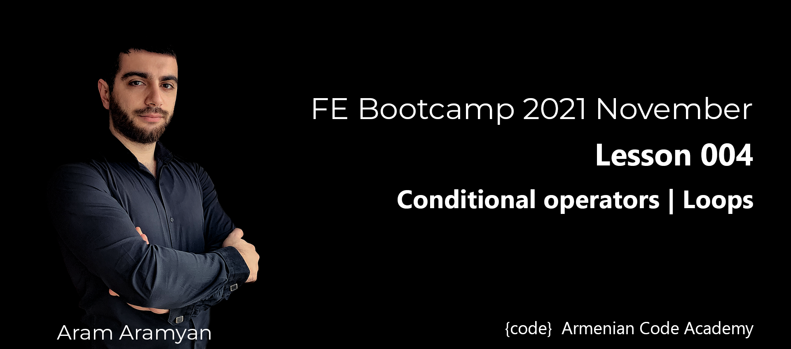

---

***Try to write a the following loop with while and do-while:***\
[loops.js](loops.js)
___

***1 Given a number. Print “odd” if the number is odd and “even” if itʼs even.***\
[1_oddEven.js](1_oddEven.js)
___

***2 Given two variables, which are the angles of a triangle. Find the third angle of the triangle. (Sum of
the angles of a triangle equals 180 degrees).***\
[2_findThirdAngle.js](2_findThirdAngle.js)
___

***3 Given a positive integer. Bring the last digit of the number to the beginning. Print the new number. If
the last digit of the inserted number is 0, number remains the same.***\
[3_lastDigit.js](3_lastDigit.js)
___
***4 Check if a number is a multiple of 3, 5 or 7 and output the appropriate message.***\
[4_checkNumber.js](4_checkNumber.js)
___
***5 Given three numbers. Sort them by the ascending order.***\
[5_sortNumbers.js](5_sortNumbers.js)
___

***6 Find the sign of product of three numbers without multiplication operator. Display the specified sign.***\
[6_findTheSign.js](6_findTheSign.js)
___

***7 Insert a digit and a number. Check whether the digits contains in the number or not.***\
[7_isContainDigit.js](7_isContainDigit.js)
___

***8 Enter a number. Reverse its first and last digits. Print the new number.***\
[8_firstLastReverse.js](8_firstLastReverse.js)
___

***9 Insert a number. Print ‘yesʼ if the number is prime, ‘noʼ otherwise.***\
[9_isPrime.js](9_isPrime.js)
___

***10 Given a number n ( n >= 0 ) . Print n Fibonacci number. (Fibonacci th series: 0, 1, 1, 2, 3, 5, 8 ..., ak =
ak-1 + ak-2).***\
[10_Fibonacci.js](10_Fibonacci.js)
___

***11 Insert a number. Calculate product and sum of the digits of the number. If product is divisible by the
sum, print the quotient, otherwise print the remainder.***\
[11_productAndSum.js](11_productAndSum.js)
___

***12 Given a sentence with missing words and an array of words. Replace all ‘_ʼ in a sentence with the
words from the array.***\
[12_missingWords.js](12_missingWords.js)
___

***13 Given mixed array of numbers, strings, booleans, nulls and undefined. Filter array and get all the
numbers in a separate array. Arrange them such as from the beginning are the odds and from the
ending the evens.***\
[13_filterOnlyNumbers.js](13_filterOnlyNumbers.js)
___

***14 Given an array of strings and numbers. Print the number of integers and the number of strings in the
array.***\
[14_printCount.js](14_printCount.js)
___

***15 Given an array of strings. Find the strings with maximum and minimum lengths in array. Print the sum
of their lengths.***\
[15_sumMaxMinLengths.js](15_sumMaxMinLengths.js)
___

***16 Given an array of numbers and a number. Find the index of a first element which is equal to that
number. If there is not such a number, that find the index of the first element which is the closest to it.***\
[16_findIndex.js](16_findIndex.js)
___

***17 Given a sentence as a string. Split it according to space and comma and create an array consisting of
the words of the array. The last word should not contain the last . or ! .***\
[17_splitString.js](17_splitString.js)
___

***18 Given an array of a size smaller than 100. It consists of numbers from 0 to 99 in any order. Create a
new array where each element from that array is placed under the index of its value. Start from the
smallest value and end with the biggest one. If there are missing values, put in its places undefined.***\
[18_arrayTask.js](18_arrayTask.js)
___

***19 Given an array consisting from the arrays of numbers (like a two-dimensional array). Find sum of each
row and print them as an array.***\
[19_sumOfEachRow.js](19_sumOfEachRow.js)
___

***20 Print the following pattern:\
1\
2 6\
3 7 10\
4 8 11 13\
5 9 12 14 15***\
[20_printPattern.js](20_printPattern.js)
___

# Optional Tasks
***1 Enter a number. Find the difference between its biggest and smallest digits.***\
[optionalTask_1.js](optionalTask_1.js)
___

***2 Convert base-2 number to base-10.***\
[optionalTask_2.js](optionalTask_2.js)
___

***3 Takes two arrays and insert the second array in the middle of the first array. The first array always has
two elements.***\
[optionalTask_3.js](optionalTask_3.js)
___

***4 Enter a positive number. Calculate and print its factorial. ( n! = n _ (n-1) _ (n-2) _ ... _ 3 _ 2 _ 1 , 0! = 1
).***\
[optionalTask_4.js](optionalTask_4.js)
___

***5 Write a program to check the validity of password input by users. Validation:***
- ***At least 1 letter between [a-z] and 1 letter between [A-Z].***
- ***At least 1 number between [0-9].***
- ***At least 1 character from [$#@].***
- ***Minimum length 6 characters.***
- ***Maximum length 16 characters.***\
[optionalTask_5.js](optionalTask_5.js)
___